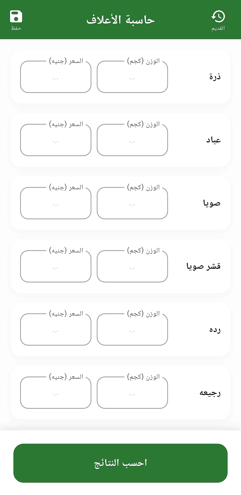
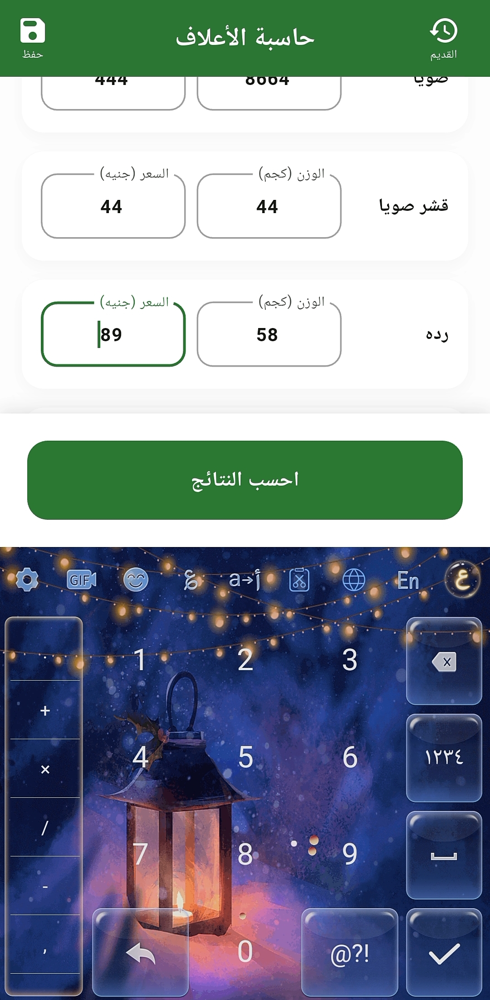
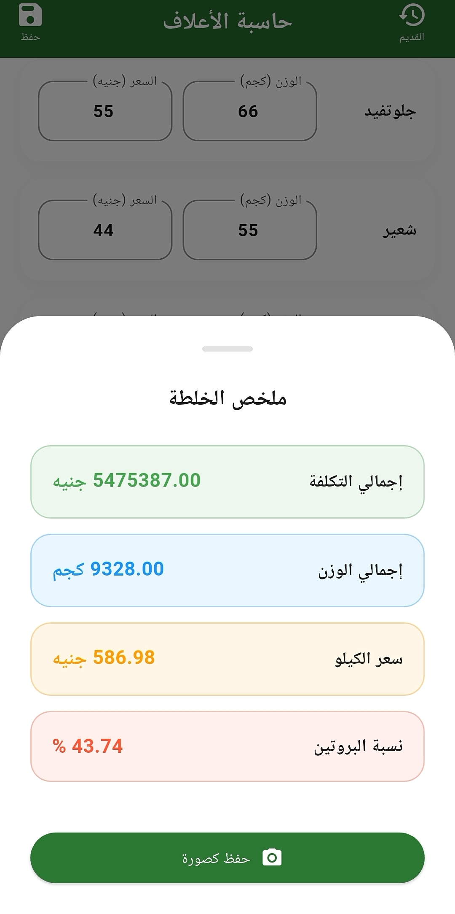
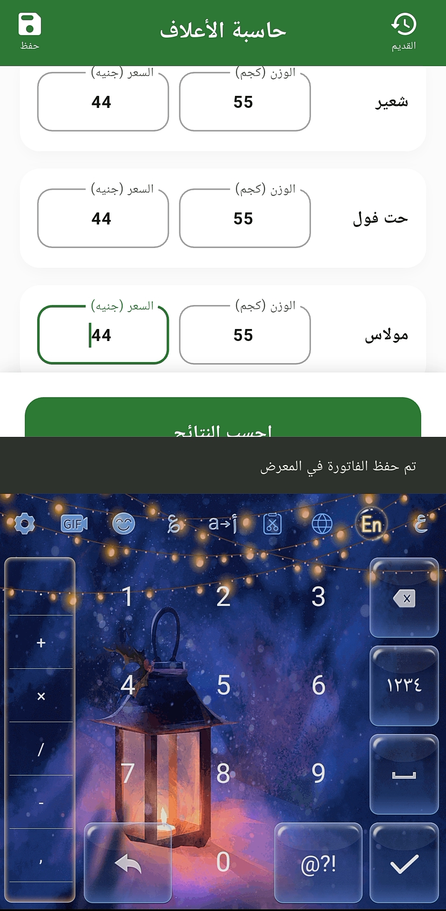
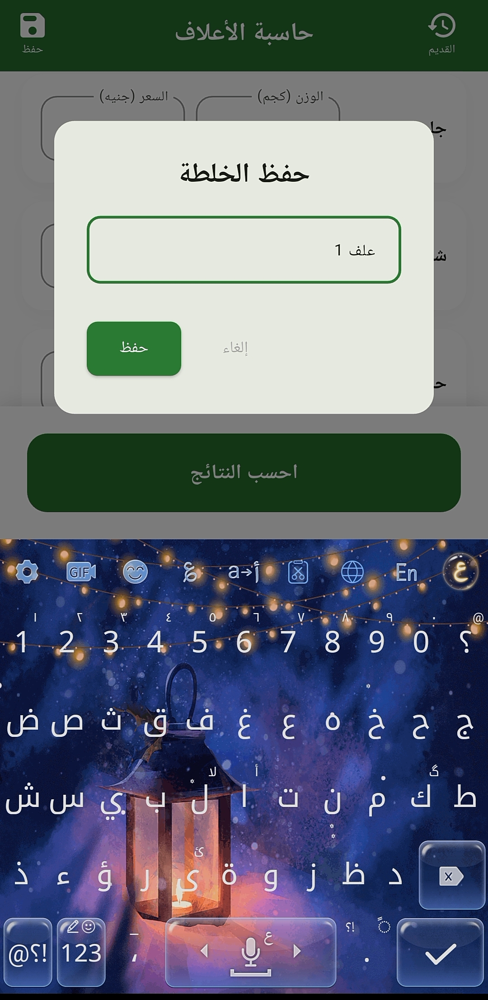
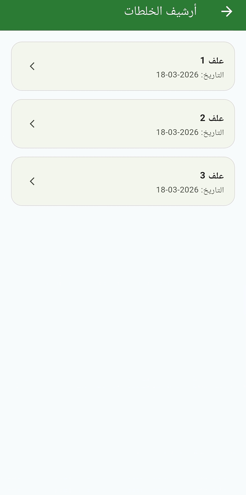
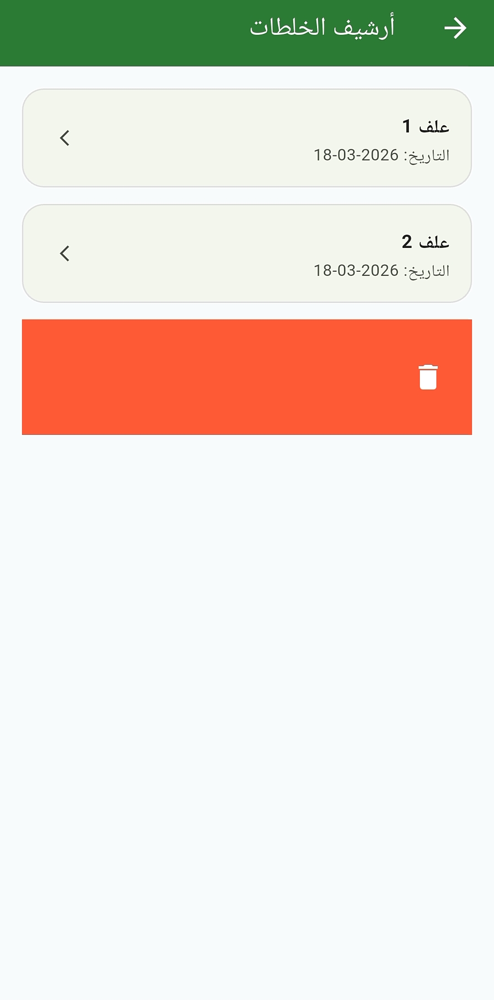

# 🌾 Smart Feed App

A modern Flutter application built for livestock feed calculation and management 🌾📱

Smart Feed App helps users calculate protein ratios and total feed costs using different raw materials with a clean and smooth user experience ✨

---

# 💙 About The Project

This project was built as a real-world application to simplify feed calculations and make the process faster and easier 🔥

The app focuses on:

* Real-time calculations ⚡
* Clean UI 🎨
* Fast local storage 💾
* Smooth user experience 📱
* Arabic RTL support 🌍

The project also helped improve skills in:

* State Management 🧠
* Flutter Architecture 🏗️
* Business Logic 🔢
* Local Storage 📦
* Responsive Design 📲
* Screenshot & Gallery Handling 📸

---

# 🎥 Demo Preview

Watch Demo Video 🎬

https://www.linkedin.com/posts/salah-hassan66190_flutter-mobiledevelopment-dart-ugcPost-7459677568842223616-0pAV?utm_source=share&utm_medium=member_android&rcm=ACoAAFY2TGMBI-LuRPjN8vwwkj21qlrQwdAev7M

---

# 📱 Screenshots

<div align="center">






<br/>





</div>

---

# ✨ Features

* Real-time protein calculation ⚡
* Total feed cost calculation 💰
* Add multiple ingredients 🌽
* Save feed mixes locally 💾
* History management 📚
* Export results as images 📸
* Responsive UI 📱
* Arabic RTL support 🌍
* Smooth navigation 🚀
* Clean and modern design 🎨

---

# 🛠 Tech Stack

## 🚀 Framework & Language

* Flutter
* Dart

## 🧠 State Management

* flutter_bloc
* bloc

## 💾 Local Storage

* shared_preferences

## 📸 Screenshot & Gallery

* screenshot
* gal

## 🎨 UI & Utilities

* flutter_screenutil
* flutter_localizations
* cupertino_icons
* uuid

## 🧰 Development Tools

* flutter_launcher_icons
* flutter_lints

---

# 📂 Folder Structure

```bash
lib/
├── core/
│   ├── theme/
│   ├── widgets/
│   └── utils/
├── features/
│   ├── calculator/
│   │   ├── data/
│   │   │   └── models/
│   │   ├── logic/
│   │   └── ui/
│   │       └── widgets/
│   └── history/
│       ├── data/
│       ├── logic/
│       └── ui/
└── main.dart
```

---

# 🚀 Getting Started

Clone the repository 📦

```bash
git clone https://github.com/SalahHassan202/flutter-smart-feed-app.git
```

Go to project folder 📂

```bash
cd flutter-smart-feed-app
```

Install dependencies ⚙️

```bash
flutter pub get
```

Run the app ▶️

```bash
flutter run
```

---

# 👨‍💻 Author

Salah Hassan

🔗 GitHub
https://github.com/SalahHassan202
